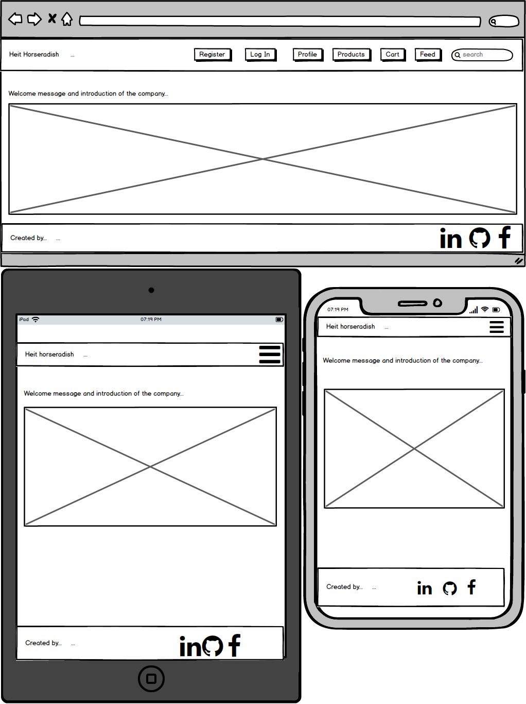
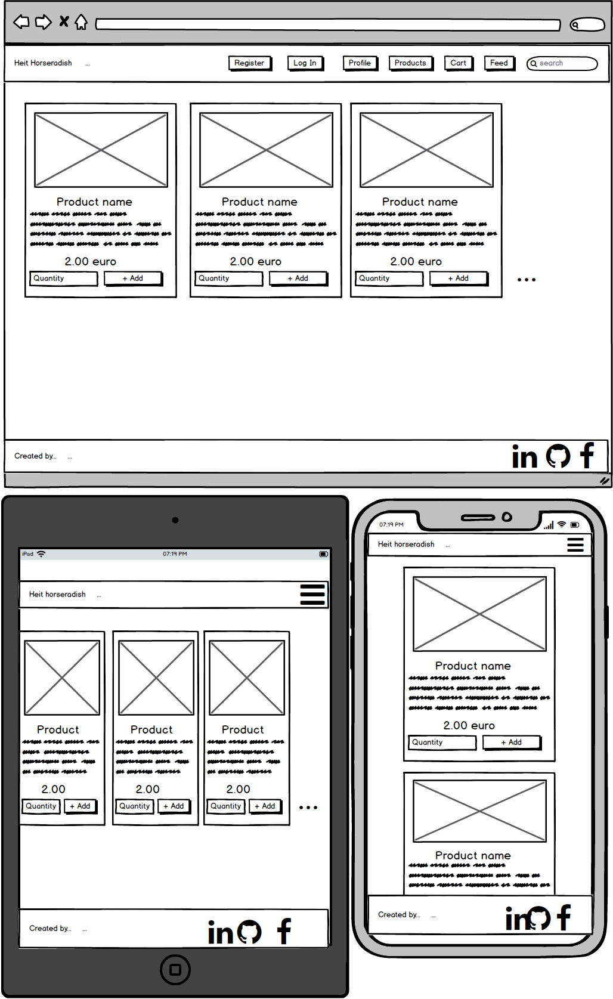
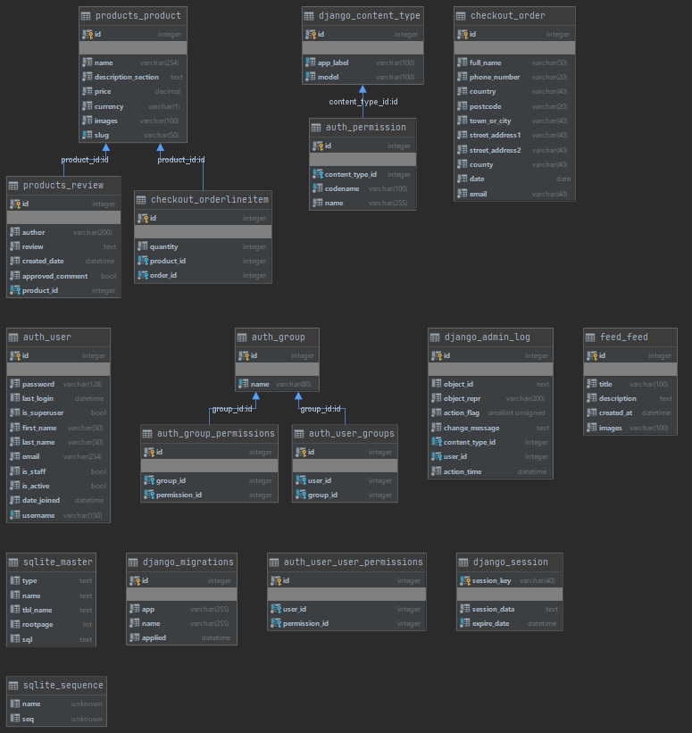

# Last Milestone Project

## Build status

[](https://travis-ci.com/TimeaKovacs86/LastMilestoneProject)

- View the deployed website: [link](https://lastmilestoneproject-webshop.herokuapp.com/)

## Index

- I. [UX](#ux)
- II. [Technologies_Used](#technologies_used)
- III. [Features](#features)
- IV. [Test](#test)
- VI [Deployment_and_version_control](#deployment_and_version_control)
- VI. [AWS](#aws)
- VII. [Media](#media)

## Description
[Up to top](#index)

The project is my fourth milestone project which is a full stack web application, which is an online shop
 where you can buy handcrafted bio horseradish products with secure payment. 
 Next to it's main functionality, we can create, and update our account, 
 and access the feed page after the login where we can get information about the new products, 
 and events where we can personally purchase the merchandise. 
 On the product page you can pick out your favorite horseradishes to buy and give some review 
 about them if you would like to. If you are logged in you can purchase your picked item directly from the cart 
 through the checkout page.

## UX
[Up to top](#index)

I was searching for a color scheme for this project which would refer to the product, what the web shop is selling, so I decided to pick rustic subjects as in raw wood for the header and footer background picture and added some texture to the pages background with the wallpaper.

I choose fonts that are optimized for interfaces, UI Optimized web fonts (Poppins), and others that are especially legible in paragraphs, 
 or particularly comfortable for reading on mobile and legible on any device - be it smartphone, desktop or tablet.(Merriweather)

Decided to use Materialize this time as a framework, because as my personal opinion, it gives a more modern look to any website than bootstrap.

### Colors & Icons

As I mentioned earlier, I picked a kinda earthy, autumn color scheme with the orange/yellowish/terracotta with a little of the dark green/blue choice for the buttons, 
because I thought it would give some extra since the product what the web shop is selling is a harvestable root vegetable.

I use fontawesome icons for the buttons and navigation menu items through the pages, to easily distinguish those elements on the pages. I use a favicon (jar), because all of our products are coming in jars.  

### Responsive

The web application is fully responsive, works properly and looks good on Mobile/Tablet/PC devices respectively.

### User stories

#### Accounts

- As a user, I want to register on the site
- Aa a user, I want to get feedback after I register on the website 
- As a user, I want to logged in right after the registration
- As a user, I want to get feedback when there is something wrong in during the registration (Unique username and password, fields)
- As a user, I want to log in the site
- As a user, I want to log out from the site
- As a user, I want to see my user details
- As a user, I want to change my user details
- As a user, I want to change my password
- As a user, I want to reset my password in that case if I forget it.
- As a user, I want to get email after password reset
- As a user, I want to get feedback when I logged in
- As a user, I want to get feedback if the password is wrong

#### Feed

- As a user, I don't want to reach the page until I am not logged in
- As a user, I want to see the Feeds after I logged in

#### Products

- As a user, I want to choose between product
- As a user, I want to get feedback after I put an item into the cart
- As a user, I want to see the product separately
- As a user, I want to put the product in the cart from the separate product page as well as from the whole products page 
- As a user, after the login I want to write review on the separate product page
- As a user, I want to get feedback if I write a review

#### Cart

- As a user, I want to add one item in the cart
- As a user, I want to add two or more item in the cart
- As a user, I want to amend the quantity
- As a user, I want to see next to cart icon in the navigation bar that how many items I picked 
- As a user, I want to see the sum products and sum value that I have to pay on the cart page
- As a user, I want to see the summary page about what I bought and how much should I pay
- As a user, I want to reach the checkout page after clicking on the Checkout button

#### Checkout

- As a user, I want to pay with my card details
- As a user, I want to get feedback after the payment
- As a user, I want to get feedback if there is something wrong with the payment(Field, Card, etc.)

#### Search

- As a user, I want to search after the products
- As a user, I get feedback if there is no matching product on the page

#### Error handling

- As a user, I want to arrive on the 404 Error page if I mistype the url
- As a user, I want to navigate back from the 404 error page

### Mock up

- **Created with [Balsamiq Mockups 3](https://balsamiq.com/) that is a user interface design tool**
    - **Landing page**:
    
    - **Log in page**:
    [Login page](project-description/mockups/Log_In.png)
    - **Register page**:
    [Login page](project-description/mockups/Register_page.png)
    - **Feed page**:
    [Feed page](project-description/mockups/Feed_page.png)
    - **Change password page**:
    [Change password page](project-description/mockups/Change_password_page.png)
    - **Profile page**:
    [Profile page](project-description/mockups/Profile_page.png)
    - **Update profile page**:
    [Update profile page](project-description/mockups/Update_profile_page.png)
    - **Product page**:
    
    - **View product page**:
    [View product page](project-description/mockups/View_product_page.png)
    - **Cart page**:
    [Cart page](project-description/mockups/Cart_page.png)
    - **Checkout page**:
    [Checkout page](project-description/mockups/Checkout_page.png)
    - **404 error page**:
    [404 error page](project-description/mockups/404_error_page.png)

## Technologies_Used
[Up to top](#index)

- [HTML5](https://www.w3.org/html/)
    - Hypertext Markup Language is the standard markup language for creating web pages and web applications.
- [CSS3](https://www.w3.org/Style/CSS/)
    - Cascading Style Sheets is a style sheet language used for describing the presentation of a document written in a 
    markup language like HTML.
- [Materialize](https://materializecss.com/about.html)
    - Materialize is a modern responsive CSS framework based on Material Design by Google.
- [JavaScript](https://developer.mozilla.org/en-US/docs/Web/JavaScript)
    - JavaScript is a lightweight interpreted or just-in-time compiled programming language with first-class functions. While it is most well-known as the scripting language for Web pages.
- [JQuery 3.2.1](https://jquery.com)
    - The project uses to simplify DOM manipulation.
- [Git](https://git-scm.com/)
    - Git is a distributed version-control system for tracking changes in source code during software development.
- [GitHub](https://github.com/)
    - GitHub Inc. is a web-based hosting service for version control using Git.
- [Django version=1.11.25](https://www.djangoproject.com/)
    -  Django is a Python-based free and open-source web framework, which follows the model-template-view architectural pattern. Django's primary goal is to ease the creation of complex, database-driven websites.
- [Python](https://www.python.org/)
    - Python is an interpreted, high-level, general-purpose programming language
- [Heroku](https://www.heroku.com/)
    - Heroku is a platform as a service (PaaS) that enables developers to build, run, and operate applications entirely in the cloud
- [PostgreSQL](https://www.postgresql.org/)
    - PostgreSQL, also known as Postgres, is a free and open-source relational database management system emphasizing extensibility and technical standards compliance. It is designed to handle a range of workloads, from single machines to data warehouses or Web services with many concurrent users.
- [SQLite](https://www.sqlite.org/)
    - SQLite is a relational database management system    
- [Jinja2](https://palletsprojects.com/p/jinja/)
    - Jinja is a web template engine for the Python programming language. Jinja2 is a modern and designer-friendly templating language for Python, modelled after Django's templates.
- [Amazon Web Services (AWS)](https://aws.amazon.com/)
    - Amazon Web Services is a subsidiary of Amazon that provides on-demand cloud computing platforms and APIs to individuals, companies, and governments, on a metered pay-as-you-go basis.
- [Amazon S3](https://aws.amazon.com/s3/)
    - Amazon Simple Storage Service (Amazon S3) is an object storage service that offers industry-leading scalability, data availability, security, and performance. This means customers of all sizes and industries can use it to store and protect any amount of data for a range of use cases, such as websites, mobile applications, backup and restore, archive, enterprise applications, IoT devices, and big data analytics.
- [Amazon IAM (Identity and Access Management)](https://aws.amazon.com/iam/)
    - AWS Identity and Access Management (IAM) enables you to manage access to AWS services and resources securely. Using IAM, you can create and manage AWS users and groups, and use permissions to allow and deny their access to AWS resources. IAM is a feature of your AWS account offered at no additional charge.

## Features
[Up to top](#index)

- Admin can add new product/create feed
- The user can add product in the cart
- User can write review under the product
- User can login/logout
- User can make payment
- User can modify/reset password
- 404 error page when there is a mistype in the url
- Search functionality between the products
- Timeline after I log in
- Store the static and media files on AWS
- Automated test and test coverage
- Database sqlite for local and travis. PostgreSQL on Heroku
- Travis CI running on sqlite

### Features left to implement

- Order history (Keep previously added products in cart, after closing the browser.)
- Bug: I get a fault message in the console every time when I am landin on a page that supposed to have a toast, but nothing triggers any message yet. I didn't find a solution to disable it.


## Test
[Up to top](#index)

You can see the test description under this [link](https://github.com/TimeaKovacs86/LastMilestoneProject/blob/master/Testing.MD)

- Information about why I commit the .travis.yml file (Copied from the Travis official site):
    - "Note that for historical reasons .travis.yml needs to be present on all active branches of your project."

## Deployment_and_version_control:
[Up to top](#index)

I use git for version control

- Git commit after every given useful part of the project
- Git push into my github repository (Parallel runs the travis tests)
- Automatic deploy on Heroku application when the running Travis test is passed
- Automatic deploy on Heroku to master branch
- Run the additional commands:
    - "migrate" command (When the database schema changed):
    ```bash
    python manage.py migrate
    ```
    - "makemigration" command (When the database schema changed):
    ```bash
    python manage.py makemigration
    ```
    - "colletcstatic" (If the static files change and need to upload into AWS bucket):
    ```bash
    python manage.py colletcstatic
    ```

    - With the following code we can be sure that locally we leave the DEBUG mode in true, but use DEBUG false during running the application on Heroku:
  ```python
    if os.environ.get('DEVELOPMENT'):
      development = True
    else:
      development = False
  
      DEBUG = development
   ```
  
#### Application hosts and databases

- For Architecture design I use MVT design pattern (Model-View-Template). Thanks to this I don't have to write raw sql queries.
- Application and Database
    - Heroku with PostgreSQL
    - Localhost with sqlite3 (Automated test with travis is running on sqlite3 as well.)
- **Database schema**:
    
    
#### Security

- Django authentication:
    - Django comes with a user authentication system. It handles user accounts, groups, permissions and cookie-based user sessions
- Secret keys and confidential data:
    - Locally:
        - Environmental variables contains
            - Environmental information
            - Secret keys
            - Database connection details
            - AWS authentication
            - Stripe paying information
    - Online:
        - Storing as environmental variables (Travis CI and Heroku)

 - For the password reset I use my own Google account, there is a"Less secure app access" function I have to turn off to be able to send out the reset email for the users, and because of the security vulnerability what this causes, The Google automatically turns it back to on, from time to time.           

## AWS
[Up to top](#index)

You can see the AWS Setup description under this [link](https://github.com/TimeaKovacs86/LastMilestoneProject/blob/master/Setup_AWS.MD)

## Media
[Up to top](#index)

- Favicon picture:
    - Picture 1: [link](https://icons8.com/icons/set/jar)
    
- Header and footer picture:
    - Picture 1: [link](https://encrypted-tbn0.gstatic.com/images?q=tbn%3AANd9GcT8ho-QShrEcenwzO-XwYUbpUjsT3fKN7xxFw&usqp=CAU)

- Welcome page picture:
    - Picture 1: [link](https://heit.hu/wp-content/uploads/2016/06/terkep_hatterrel-300x218.png)

- Feed page pictures:
    - Picture 1: [link](https://thumbs.dreamstime.com/b/horseradish-honey-166263672.jpg)
    - Picture 2: [link](https://foodal.com/wp-content/uploads/2017/06/Raw-Horseradish-Wrapped-in-Paper-and-Twine.jpg)
    - Picture 3: [link](https://media.istockphoto.com/photos/green-peppers-horseradish-garlic-and-herbs-on-a-slate-cutting-board-picture-id1055873534?k=6&m=1055873534&s=612x612&w=0&h=7Ow2K18uFZJb8OYSYK6_WYZlx2PqX9NrapN5XtUkwNw=)

- Products page pictures:
    - Picture 1: [link](https://heit.hu/wp-content/uploads/2016/06/SZB1210-1024x631.jpg)
    - Picture 2: [link](https://heit.hu/wp-content/uploads/2016/06/SZB1204-1024x673.jpg)
    - Picture 3: [link](https://heit.hu/wp-content/uploads/2016/06/SZB1181-1024x684.jpg)
    - Picture 4: [link](https://heit.hu/wp-content/uploads/2016/06/SZB1198-1024x669.jpg)
    - Picture 5: [link](https://heit.hu/wp-content/uploads/2016/06/SZB1176-1024x644.jpg)
    - Picture 6: [link](https://heit.hu/wp-content/uploads/2016/06/SZB1189-1024x691.jpg)
    - Picture 7: [link](https://heit.hu/wp-content/uploads/2016/06/SZB1184-768x927.jpg)