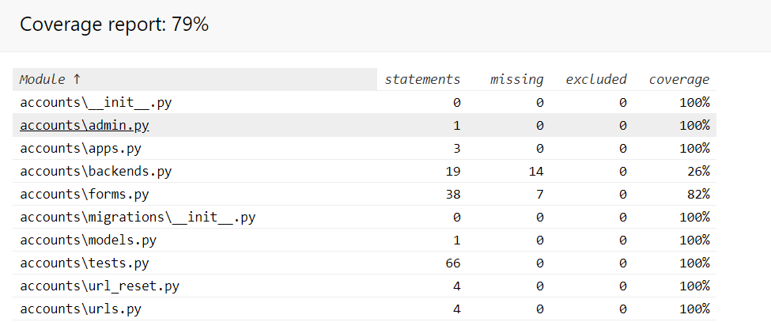

# Testing

For this project I could use mixed testing that means. I test the project manually and runs the test automatically locally
and in the cloud as well as you can see below.

## Manual Testing:

For Manual testing me and some of my friend and acquaintances tested the web application.

- Testing devices:
    - Mobile:
        - Google Pixel 3
        - iPhone SE
    - Tablet:
        - iPad
    - PC and notebooks with HD resolution


- Jigsaw CSS validator: [link](https://jigsaw.w3.org/css-validator/#validate_by_input)

### User stories 

#### Accounts

- Scenario: I want to register on the site
    - I click on the register menu
    - I fill the user details
    - I click on the Register button
    - I arrive on the Feed page
    - I get notification about the successful registration

- Scenario outline: I get feedback if I miss to fill a field 
    - I am on the registration page
    - I miss to fill the <field_name>
    - I click on the Register button
    - I get back a notification about the missing field    

|field_name|
|:--------:|
|Username|
|First name|
|Last Name|
|Email|
|Password|
|Password Confirmation|

- Scenario: Unique name and format
    - I am on the registration page
    - I give an used <field_name>
    - I click on the Register button
    - I get back a notification about the missing or mistyped field

|field_name|
|:--------:|
|Username|
|E-mail|

- Scenario: I get back error message if the password and the password confirmation field is not the same
    - I am on the registration page
    - I fill all the required field
    - I give two different password for the two field
    - I get feedback about the unmatched passwords

- Scenario: I log in the site
    - I click on the login navigation item
    - I fill my username and password 
    - I click on the Login button
    - I arrive on the Feed page and get notification about the successful login

- Scenario: I mistype the credentials (and get notification) 
    - I am on the login page
    - I mistype my username or password
    - The login page reloading and I get back a notification about the wrongly given credentials

- Scenario: I can log out from the shop
    - I log into the shop
    - I click on the Log out navigation item
    - I log out and redirected on the Welcome page

- Scenario: I can see my details under the Profile page
    - After I logged in I click on the Profile page
    - On the profile page I can see my Profile detail

- Scenario: I can change my password on the Profile page (get back notification)
    - I am on the Profile page
    - I click on the Change password button
    - I give my old and new passwords as the site requested
    - I click on the Submit button
    - I redirected on the Profile page and get notification about the successfully updated password

- Scenario: I get feedback if I mistype my passwords
    - I am on the password changing page
    - I mistype my old password or my new password/password confirmation fields
    - I get back notification about the mistyping

- Scenario: I can reset my password if I forget it and get an email about the reset details
    - I am on the login page
    - I click on the "Forget your password?" button
    - I give my e-mail address
    - I click on the "Reset my password" button
    - I get an email with instruction in it about how to reset my password

#### Feed page

- Scenario: I can see the Feed page after login
    - I arrive on the page
    - I log in
    - I am arrive on the Feed page and the Feed menu is available
- Scenario: I can't see the Feed page when I am not logged in
    - I arrive on the page
    - I don't log in
    - I can't see the Feed menu option and the Feed page (Even if I type in the url)

#### Products page

- Scenario: I can see the products on the Products page
    - I click on the Products page
    - I can see the available products

- Scenario: I can give product into the cart and get feedback about that
    - I am on the Products page
    - I click on the Add button
    - The item(s) was/were given into my cart and get notification about that

- Scenario: I can see the product details page
    - I am on the Products page
    - I click on one of the product's name
    - I redirected for the detailed product page

- Scenario: I can give product into the cart in the detailed product page
    - I am on the detailed product page
    - I set the quantity for the product
    - I click on the Add button
    - The item(s) was/were given into my cart and get notification about that

- Scenario: I can write review on the detailed product page after I logged in and get notification about that
    - I logged in previously
    - I am on the detailed product page
    - I write a comment
    - I click on the Comment button
    - I can see my comment and I get back notification about the successfully given comment
    
- Scenario: I can't write review on the detailed product page
    - I am not logged in before
    - I am on the detailed product page
    - I can't write comments, but I can see them

#### Cart page

- Scenario: I can see on the navigation bar how many items I've added
    - I am on the product page
    - I give 3 items in the cart
    - I can see a "3" number next to the cart in the navigation bar

- Scenario: I can't see product under the cart menu until I don't add a product in it
    - I click on the Cart navigation item
    - The page is empty until I don't add at least one item in it

- Scenario: I can see the given product under the Cart menu
    - I am on the product page
    - I give 3 items in the cart
    - I click on the Cart navigation item
    - I can see the 3 given items on the Cart page

- Scenario: I can delete an item (notification)
    - I am on the cart page
    - I have previously given item in the cart
    - I click one of the trash icon
    - The page refresh and the chosen item disappear from the cart and we get notification about this

- Scenario: I can amend the quantity of the item
    - I am on the cart page
    - I have previously given item in the cart
    - I modify one of items quantity
    - The page refresh and the chosen item's quantity changed and we get notification about this

- Scenario: I can check out from the cart page after I logged in
    - I am on the cart page
    - I have previously given item in the cart
    - I click on the Checkout button
    - I redirected on the Checkout page
    
- Scenario: I can't check out until I am not logged in
    - I am on the cart page
    - I have previously given item in the cart
    - I click on the Checkout button
    - I redirected on the Login page
    
- Scenario: I can see the sum value of how much should I pay for the products
    - I am on the cart page
    - I have previously given item in the cart
    - There is a sum value about how much the given products cost in all
    
- Scenario: I can reach the product details page with clicking on the product name
    - I am on the Cart page
    - I click on one of the product's name
    - I redirected for the detailed product page

#### Checkout page

- Scenario: I can see the product on the checkout page
    - I arrive on the Checkout page
    - I can see the product list that I want to buy

- Scenario: I can see how much should I pay
    - I arrive on the Checkout page
    - I can see the Sum value that should I pay

- Scenario: I can pay
    - I arrive on the Checkout page
    - I fill out the required field
    - I click on the Checkout button
    - I redirecting to the product page and I can see the message about the success payment

- Scenario: I give wrong card credentials or user details
    - I miss to type or give inadequate value for the <required_field>
    - I click on the Checkout page
    - I get back error about the missing field
    
|required_field|
|:-------:|
|Credit card number|       
|Security code (CVV)|
|Month|
|Year|
|Full name|
|Phone number|
|Country|
|Postcode|
|Town or City|
|Street address|
    
#### Search

- Scenario: I can find a product based on the searching criteria
    - I type a valid product name on the search field
    - I click on the Search button
    - I get back the result 
    
- Scenario: There is no match for my searching criteria
    - I type an invalid product name on the search field
    - I click on the Search button
    - I don't get back result and I can see an information about the missing searching result

#### Error handling

- Scenario: I navigate to the 404 error page in the case of wrong url
    - I am on the page
    - I mistype the url
    - I can see the 404 error
    
- Scenario: I can navigate back 
    - I am on the page
    - I mistype the url
    - I can see the 404 error
    - I click on the "Back to the page button"
    - I arrive back to the page


## Automated Testing;

### Locally

In the python console I run the command to execute test:
````bash
python manage.py test
````

- Coverage: [ 79% ] with 43 tests
    - Install coverage with command:
    ````bash
    pip install coverage
    ````
    - Coverage check with command:
    ````bash
    coverage run --source='.' manage.py test
    ````
    - Run Report with command:
    ````bash
    coverage report
    ````
    - Creates htmlcov report folder locally with command:
    ````bash
    coverage html
    ````
    - I put the htmlcov folder in the .gitignore file 
    - 

### Cloud

- Automated testing with Travis CI [link](https://travis-ci.org/)

I use Travis which is a CI (Continuous Integration) service used to test software in the cloud. After a commit the 
travis jobs runs to test on the pipeline.It helps to me to get fast feedback about the tests. 

## Stripe details:

In order to test Stripe payment we can use the below given card details to test the payment.

- Card Numbers:
    - Numbers:
        - 4242 4242 4242 4242
    - Brand:
        - Visa
    - CVC:
        - Any 3 digits
    - Date:
        - Any future date